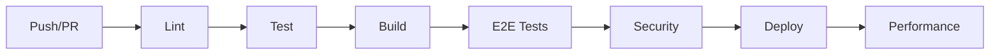

# Content Automation Platform - Build & Deployment Guide

## Overview

This guide provides comprehensive instructions for building, testing, and deploying the Content Automation Platform.

## Prerequisites

- Node.js >= 18.0.0
- npm >= 9.0.0
- Git
- Docker (optional for containerized deployment)

## Development Setup

### 1. Clone and Install

```bash
git clone <repository-url>
cd content-automation-platform
npm install
```

### 2. Environment Variables

Create `.env.local` file:

```env
VITE_APP_TITLE=Content Automation Platform
VITE_API_BASE_URL=http://localhost:3001
VITE_ENVIRONMENT=development
VITE_SENTRY_DSN=<your-sentry-dsn>
VITE_ANALYTICS_ID=<your-analytics-id>
```

### 3. Start Development Server

```bash
npm run dev
```

The application will be available at `http://localhost:3000`

## Build System

### Modern Bundler Setup (Vite)

The project uses Vite as the bundler with the following features:

- **Hot Module Replacement**: Instant updates during development
- **Tree Shaking**: Automatic dead code elimination
- **Code Splitting**: Intelligent chunk splitting for optimal loading
- **Asset Optimization**: Automatic optimization of images, fonts, and other assets

### Build Commands

```bash
# Development build
npm run build:dev

# Production build
npm run build

# Build with bundle analysis
npm run build:analyze

# Clean build artifacts
npm run clean
```

### Bundle Configuration

- **Output Directory**: `dist/`
- **Source Maps**: Enabled for development
- **Minification**: Terser with console.log removal in production
- **Chunk Splitting**: Separate vendor, router, and application chunks

## Testing Infrastructure

### Unit Testing (Vitest)

```bash
# Run all tests
npm run test

# Run tests in watch mode
npm run test:watch

# Run tests with UI
npm run test:ui

# Generate coverage report
npm run test:coverage
```

#### Test Structure

```
tests/
├── unit/           # Unit tests
├── integration/    # Integration tests
├── e2e/           # End-to-end tests
└── setup.ts       # Test configuration
```

### E2E Testing (Playwright)

```bash
# Run E2E tests
npm run playwright

# Run E2E tests with UI
npm run playwright:ui

# Run tests on specific browser
npx playwright test --project=chromium

# Generate test reports
npm run playwright:report
```

### Test Coverage Targets

- **Branches**: 80%
- **Functions**: 80%
- **Lines**: 80%
- **Statements**: 80%

## CI/CD Pipeline

### GitHub Actions Workflows

#### 1. Main CI/CD Pipeline (`.github/workflows/ci-cd.yml`)

**Trigger Events:**

- Push to `main`/`develop` branches
- Pull requests to `main`
- Published releases

**Jobs:**

1. **Lint & Type Check**: ESLint, Prettier, TypeScript
2. **Test**: Unit tests with coverage
3. **Build**: Production build with analysis
4. **E2E Tests**: Cross-browser E2E testing
5. **Security Audit**: Dependency vulnerability scanning
6. **Deploy**: Production deployment (releases only)
7. **Performance**: Lighthouse performance audit

#### 2. Dependency Updates (`.github/workflows/dependency-updates.yml`)

- Weekly dependency updates
- Automated PR creation
- Test validation before PR

#### 3. Code Quality (`.github/workflows/code-quality.yml`)

- Code complexity analysis
- Bundle size monitoring
- Secret detection
- TypeScript compilation

#### 4. Performance Monitoring (`.github/workflows/performance.yml`)

- Lighthouse audits
- Bundle analysis
- Memory profiling

### Pipeline Stages



## Development Tools

### Pre-commit Hooks (Husky + lint-staged)

```bash
# Install hooks
npm run prepare

# Manual pre-commit check
npm run pre-commit
```

### Code Formatting

```bash
# Format code
npm run format

# Check formatting
npm run format:check
```

### Linting

```bash
# Run linter
npm run lint

# Fix linting issues
npm run lint:fix
```

### Commit Conventions

```bash
# Interactive commit
npm run commit
```

**Commit Types:**

- `feat`: New feature
- `fix`: Bug fix
- `docs`: Documentation
- `style`: Code style
- `refactor`: Code refactoring
- `perf`: Performance
- `test`: Testing
- `build`: Build system
- `ci`: CI configuration
- `chore`: Maintenance

## Deployment

### Production Build

```bash
# Build for production
npm run build

# Preview production build
npm run preview
```

### Environment Configuration

#### Development (.env.development)

```env
VITE_ENVIRONMENT=development
VITE_API_BASE_URL=http://localhost:3001
VITE_DEBUG=true
```

#### Staging (.env.staging)

```env
VITE_ENVIRONMENT=staging
VITE_API_BASE_URL=https://staging-api.example.com
VITE_DEBUG=false
```

#### Production (.env.production)

```env
VITE_ENVIRONMENT=production
VITE_API_BASE_URL=https://api.example.com
VITE_DEBUG=false
```

### Deployment Strategies

#### 1. Static Site Deployment

```bash
# Deploy to Netlify
npm run build
npx netlify deploy --prod --dir=dist

# Deploy to Vercel
npm run build
npx vercel --prod
```

#### 2. Docker Deployment

```dockerfile
# Dockerfile
FROM node:18-alpine AS builder
WORKDIR /app
COPY package*.json ./
RUN npm ci --only=production
COPY . .
RUN npm run build

FROM nginx:alpine
COPY --from=builder /app/dist /usr/share/nginx/html
COPY nginx.conf /etc/nginx/nginx.conf
EXPOSE 80
CMD ["nginx", "-g", "daemon off;"]
```

#### 3. Kubernetes Deployment

```yaml
# deployment.yaml
apiVersion: apps/v1
kind: Deployment
metadata:
  name: content-automation-platform
spec:
  replicas: 3
  selector:
    matchLabels:
      app: content-automation-platform
  template:
    metadata:
      labels:
        app: content-automation-platform
    spec:
      containers:
        - name: app
          image: content-automation-platform:latest
          ports:
            - containerPort: 80
          resources:
            requests:
              memory: '256Mi'
              cpu: '250m'
            limits:
              memory: '512Mi'
              cpu: '500m'
```

## Monitoring & Analytics

### Error Reporting (Sentry)

```typescript
// src/utils/sentry.ts
import * as Sentry from '@sentry/react'

if (import.meta.env.PROD) {
  Sentry.init({
    dsn: import.meta.env.VITE_SENTRY_DSN,
    environment: import.meta.env.VITE_ENVIRONMENT,
    tracesSampleRate: 1.0,
  })
}
```

### Performance Monitoring

```typescript
// src/utils/performance.ts
export const reportWebVitals = (onPerfEntry?: (metric: any) => void) => {
  if (onPerfEntry && onPerfEntry instanceof Function) {
    import('web-vitals').then(({ getCLS, getFID, getFCP, getLCP, getTTFB }) => {
      getCLS(onPerfEntry)
      getFID(onPerfEntry)
      getFCP(onPerfEntry)
      getLCP(onPerfEntry)
      getTTFB(onPerfEntry)
    })
  }
}
```

### Analytics Integration

```typescript
// src/utils/analytics.ts
declare global {
  interface Window {
    gtag: (...args: any[]) => void
  }
}

export const trackEvent = (action: string, category: string, label?: string) => {
  if (typeof window.gtag !== 'undefined') {
    window.gtag('event', action, {
      event_category: category,
      event_label: label,
    })
  }
}
```

## Rollback Capabilities

### Git-based Rollback

```bash
# View previous releases
git tag --list "v*"

# Rollback to previous version
git checkout v1.2.0
npm run build
npm run deploy
```

### Database Rollback

```sql
-- View migrations
SELECT * FROM schema_migrations ORDER BY version DESC;

-- Rollback specific migration
-- (depends on your migration tool)
```

### Feature Flags

```typescript
// src/utils/featureFlags.ts
export const FEATURES = {
  NEW_DASHBOARD: import.meta.env.VITE_FLAG_NEW_DASHBOARD === 'true',
  ADVANCED_ANALYTICS: import.meta.env.VITE_FLAG_ANALYTICS === 'true',
  BETA_FEATURES: import.meta.env.VITE_ENVIRONMENT !== 'production',
}
```

## Security Best Practices

### 1. Environment Variable Management

- Never commit `.env` files
- Use secret management tools (AWS Secrets Manager, HashiCorp Vault)
- Rotate secrets regularly

### 2. Dependency Security

```bash
# Audit dependencies
npm audit

# Fix vulnerabilities
npm audit fix

# Automated security scanning
npm run security:check
```

### 3. Content Security Policy

```html
<meta
  http-equiv="Content-Security-Policy"
  content="
  default-src 'self';
  script-src 'self' 'unsafe-inline' https://analytics.google.com;
  style-src 'self' 'unsafe-inline';
  img-src 'self' data: https:;
  connect-src 'self' https://api.example.com;
"
/>
```

## Performance Optimization

### 1. Bundle Optimization

- Code splitting by routes
- Lazy loading components
- Tree shaking unused dependencies
- Compression with Brotli/Gzip

### 2. Asset Optimization

- Image optimization and WebP conversion
- Font subsetting and preloading
- CSS critical path optimization

### 3. Runtime Performance

- React.memo for component memoization
- useMemo/useCallback for expensive computations
- Virtual scrolling for large lists
- Service worker for offline support

## Troubleshooting

### Common Issues

#### Build Fails

```bash
# Clear cache
npm run clean
rm -rf node_modules package-lock.json
npm install
```

#### Test Failures

```bash
# Update snapshots
npm run test -- -u

# Debug tests
npm run test:debug
```

#### Deployment Issues

```bash
# Check build logs
npm run build -- --verbose

# Test production build locally
npm run preview
```

### Performance Issues

```bash
# Analyze bundle size
npm run build:analyze

# Profile performance
npm run profile:memory
npm run profile:cpu
```

## Maintenance

### Regular Tasks

1. **Weekly**: Dependency updates, security scanning
2. **Monthly**: Performance audits, analytics review
3. **Quarterly**: Architecture review, tech debt assessment

### Monitoring Dashboards

- Build performance: Build times, success rates
- Application performance: Core Web Vitals, error rates
- User metrics: Page views, conversion rates, bounce rates

## Support

For questions or issues:

1. Check this documentation
2. Review GitHub Issues
3. Contact the development team

---

**Last Updated**: 2026-01-08
**Version**: 1.0.0
**Maintainer**: Content Automation Team
